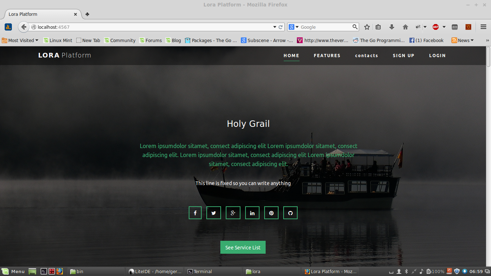
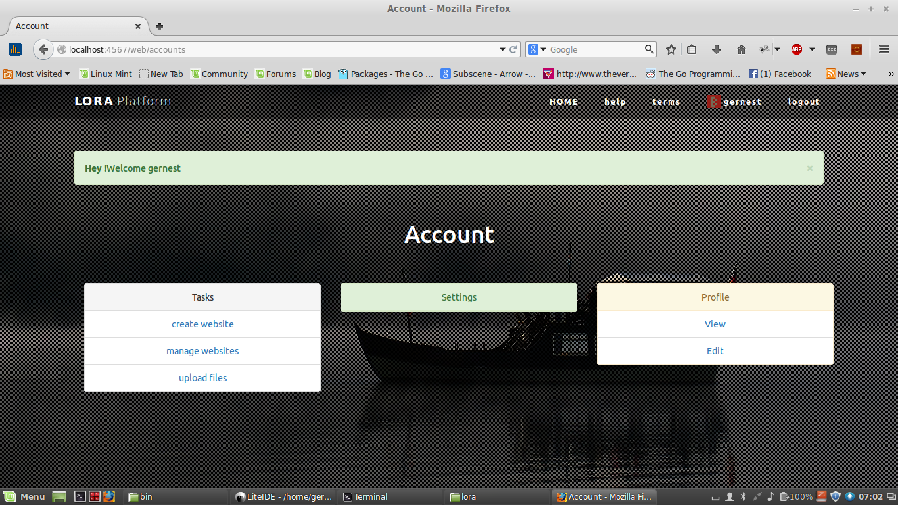
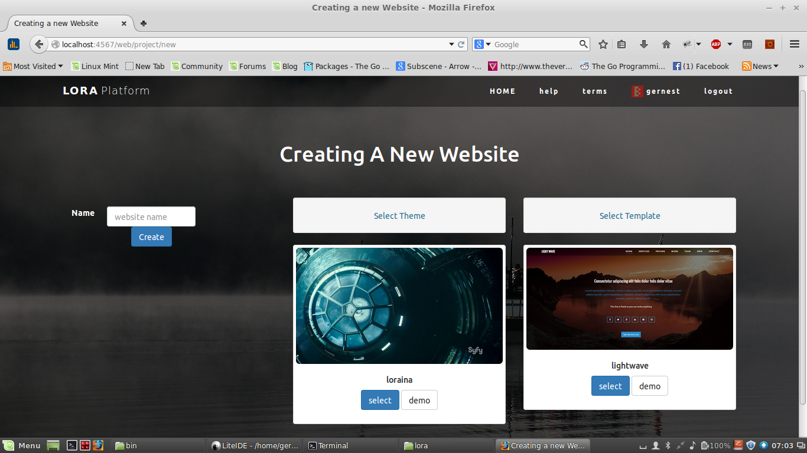

# Lora 
Create, manage and deploy  static websites witth clicks of a button

# Features
* multiple websites
* subdomains
* multi user
* Themes
* Templates

Lora uses an excelent static generator hugo. So, templates for lora are basically hugo website, and theme support is based on hugo themes.

# Dependencies
* Postgresql database
* hugo static site generator
* go programming language
* beego framework

# Warning

This is an experimental, proof of concept. It works like a charm but use it at your own risks. I created this to get hands on experience
on go idioms and understand the language better.

# NOTICE
Due to lack of interest, I no longer maintain this code. This does not mean it doesn't work. All the features mentioned above have been implemented. I will only cease to add any more features, or try to make further changes to the code base.'

# Installation
clone the repo in your `GOPATH`

    git clone https://github.com/gernest/lora

Then cd to the path and install all dependencies

    go get ./..

Then build and run

	go build
    ./lora

Dont forget to change content of the file `conf/app.conf` to suit your settings.

# Screenshots

# Licence
 Copyright 2015 Geofrey Ernest , All Rights Reserved.

 Licensed under the Apache License, Version 2.0 (the "License"): you may
 not use this file except in compliance with the License. You may obtain
 a copy of the License at

[http://www.apache.org/licenses/LICENSE-2.0](http://www.apache.org/licenses/LICENSE-2.0)

 Unless required by applicable law or agreed to in writing, software
 distributed under the License is distributed on an "AS IS" BASIS, WITHOUT
 WARRANTIES OR CONDITIONS OF ANY KIND, either express or implied. See the
 License for the specific language governing permissions and limitations
 under the License.
